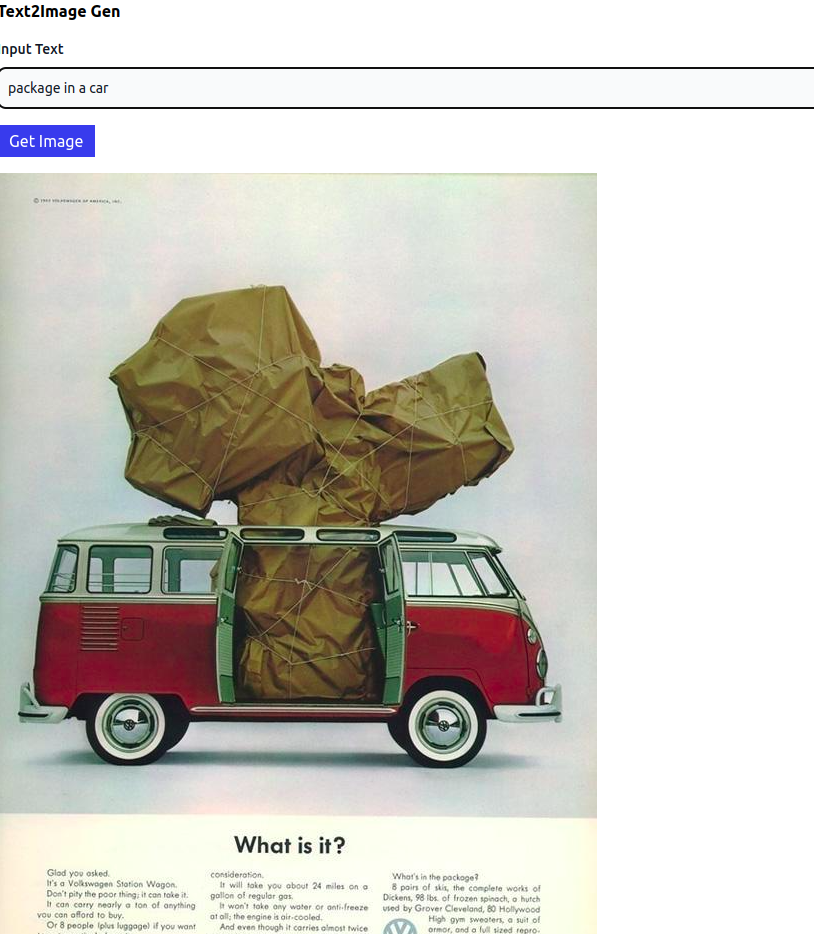

# Text-to-Image Search System using Qdrant, CLIP, and FastAPI

## Table of Contents

- [Overview](#Overview)
- [Installation and Setup](#Installation_and_Setup)
- [Usage](#Usage)
- [Architecture](#Architecture)
- [Steps](#Steps)
- [Suggested Evaluation Process](#Suggested_Evaluation_Process)
- [Results](#Results)
- [Conclusion](#Conclusion)
- [TODO](#TODO)

## Overview

This project implements a text-to-image search system using Qdrant as a vector database, CLIP (Contrastive Language-Image Pre-training) for text and image embeddings, and a web interface for user interaction using FastAPI Jinja2Templates and HTMX. The system allows users to input a search query, embed the text, find the closest image in the dataset based on the text embedding, get its ID and uses the ID to extract the image from the datasetd and display the closest image on a web page.

## Installation and Setup

> Note: Although unconventional, I included a sample of the dataset with this repository. If you prefer to use a different dataset, simply replace the contents of the 'dataset' folder.

1. Clone the repository:

`git clone https://github.com/Sudonuma/Text2ImageSearch.git`


2. navigate to the cloned directory:

`cd Text2ImageSearch`


3. Create a Conda environment and activate it (if Conda is installed) or directly install the requirements:

`conda create --name text2im python=3.9`

`conda activate text2im`

4. install the depandencies:

`pip install -r requirements.txt`


5. by default the script will run using Qdrant cloud services:
If you wish to run locally, you need to set the cloud parameter to False in ([main file](./main.py) when you create the client. (see [create Client file](src/qdrant_client.py))) (Note: Parameters are not managed with argparse, so you will need to manually change it in the code).
Before running the script:

- Set your API key and URL:

  ```
  export API_KEY="YOUR_API_KEY"
  export API_URL="YOUR_API_URL"
  ```

> NOTE: if you want to run on local host run (in a seperate terminal):

```

docker run -p 6333:6333 -v $(pwd)/qdrant_storage:/qdrant/storage qdrant/qdrant

```

6. Run Uvicorn to start the server:

` uvicorn main:app --reload `

**Note:** At startup event the program will compute the data embeddings and create the collection. 

> **This approach was chosen for rapid prototyping purposes.**

## Usage

- The embedding process is complete when the logger indicates the end of embedding.
- go to [http://127.0.0.1:8000/index](http://127.0.0.1:8000/index)

- **Index Endpoint:** [http://127.0.0.1:8000/index](http://127.0.0.1:8000/index) The index endpoint hosts the frontend where users can input search queries and view the resulting image along with its score.
- **EDA Endpoint:** [http://127.0.0.1:8000/EDA](http://127.0.0.1:8000/EDA) The EDA endpoint offers exploratory data analysis of the advertisement dataset.

- Enter your text query in the input field and click search. The image with the highest score will appear.


## Architecture

The following graphs provide an idea of the project's components and architecture:

Abstract architecture:


A more detailed architecture:


## Steps

1. **EDA**
   - Exploratory data analysis for provided advertisement dataset.
   Insights about the data can be found either in [Notebook](EDA.ipynb) or on the EDA endpoint.

   if you whish to run the extract text cell you have to install tesseract:

   `sudo apt install libtesseract-dev`
   then
   `pip install pytesseract`


2. **Embedding Generation:**
   - Used CLIPProcessor and CLIPModel to generate embeddings for images.
   - NOTE: if the dataset has textual data we could have also embedded the textual data to get better results. 
   - The dataset have textual information inside the image itself so we can extract it using OCR, clean it and include it in the embeddings to get better results. 

3. **Vector Database:**
   - Used Qdrant as the vector database to store the embeddings generated for images.
   - Stored embeddings with corresponding IDs to facilitate retrieval.

4. **Search Engine:**
   - Accept user input in the form of textual queries.
   - Embed the query text using CLIP and search for the closest image in the dataset based on the text embedding.
   - Retrieve the ID of the closest image from the dataset.

5. **Web Interface:**
   - Developed a web interface using Jinja2templates and HTMX for dynamic content.
   - Allow users to input search queries through a web form.
   - Retrieve the closest image corresponding to the search query.
   - Render the closest image on the web page for user interaction.


### Suggested Evaluation Process

To effectively show the capabilities of our text-to-image search system, we need to consider various types of queries that users might input and evaluate the system's performance based on relevance and efficiency. 

1. labelling the dataset:
    - we can manually label a subset of data with relevant keywords 
      describing the images' content.
    - in our case the dataset images have text in them so we extracted the text with OCR, we will then chose images with their corresponding text and use them for the evaluation.
    > **You can find the extracted text in the dataset_text folder.**
    - we can include diverse categories from our dataset such as: cars advertisement, like audi or mercedez, car headlights, phones, sports and sports clothing, networking, computers...

2. Query choice:
    - The set of querries should represent various search intents and complexities.

3. Evaluation metrics
    - We will use metrics like Precision, Recall, and Mean Average Precision (mAP) to assess the relevence of retrieved images of each query.
    - Precision: Proportion of relevant images among the retreived images.
    - Recall: Proportion of relevant images retrieved among all relevant images.
    - mAP: Average Precision across multiple queries.
4. types of querries used for evaluation: 
    1. exact match querry
    2. semantic querry
    3. Ambiguous Queries
    3. Complex queries
    4. ineffective queries: Vague or rare querries


### Results:

Below are examples of results for different types of queries, including exact match and complex queries. **However, I have not conducted the evaluation process to obtain evaluation values and did not discuss the results.** (For more results, please refer to the 'results' folder).





## Conclusion

This text-to-image search system leverages the power of CLIP for semantic understanding and Qdrant for efficient vector storage and retrieval. By combining machine learning techniques with a user-friendly web interface, the system provides users with an experience for discovering relevant images based on textual queries.


## TODO

1. Test code with pytest
2. check the output of some functions for type hinting
3. dataset should be tracked with DVC.
4. Improve the EDA and the pre-processing step.
6. Clean the extracted text and include it in the embedding
7. Run the upserting and embedding before launching the app
8. Give the user the possibility to include an image in the database
...